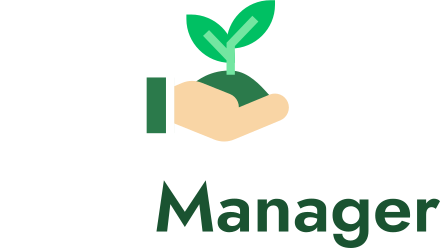

<div align="center" id="top"> 
	
</div>

<!-- <p align="center">
  

  

  

  

</p> -->

<p align="center">
  <a href="#dart-sobre">Sobre</a> &#xa0; | &#xa0; 
  <a href="#sparkles-funcionalidades">Funcionalidades</a> &#xa0; | &#xa0;
  <a href="#rocket-tecnologias">Tecnologias</a> &#xa0; | &#xa0;
  <a href="#clipboard-requisitos">Requisitos</a> &#xa0; | &#xa0;
  <a href="#computer-instalando">Instalando</a> &#xa0; | &#xa0;
  <a href="#memo-license">License</a> &#xa0; | &#xa0;
  <a href="https://github.com/LDrawe" target="_blank">Autor</a>
</p>

<br>

## :dart: Sobre ##

<h3>
Aplicação mobile desenvolvida no NLW #05 para auxílio e controle de regagem de plantas
</h3>

## :sparkles: Funcionalidades ##

✔️ Autenticação com o seu nome\
✔️ Adicionar e remover plantas escolhidas para ser lembrado\
✔️ Escolher horário para ser lembrado de regar a planta\
✔️ Recebimento de notificações para lembrá-lo de regar suas plantas

## :rocket: Tecnologias ##

As seguintes tecnologias foram usadas neste projeto:

- [Expo](https://expo.io/)
- [React Native](https://reactnative.dev/)
- [TypeScript](https://www.typescriptlang.org/)
- [Lottie](https://lottiefiles.com/)

## :clipboard: Requisitos ##

Antes de começar, você precisa ter o [Git](https://git-scm.com) e o [Node](https://nodejs.org/en/) instalados.

## :computer: Instalando ##

```bash
# Clone este projeto
$ git clone https://github.com/LDrawe/PlantManager.git

# Entre na pasta
$ cd PlantManager

# Instale as dependências
$ yarn global install expo-cli
$ yarn install

# Rode o projeto
$ yarn dev

# Após rodar esse comando dois processos irão executar. um para o projeto e outra para a Api
# Se estiver no Windows, duas janelas do cmd irão abrir referente aos processos, se estiver no
# Mac ou Linux os comandos serão rodados em paralelo
```

## :memo: License ##

Este projeto está sob a licença MIT. Para mais detalhes, veja o arquivo de [LICENÇA](LICENSE.md).


Feito por <a href="https://github.com/LDrawe" target="_blank">LDrawe</a>

&#xa0;

<a href="#top">Voltar para o topo</a>
